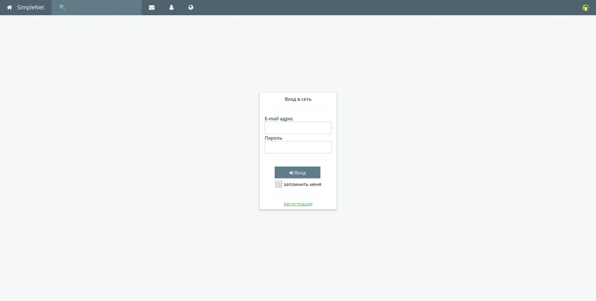
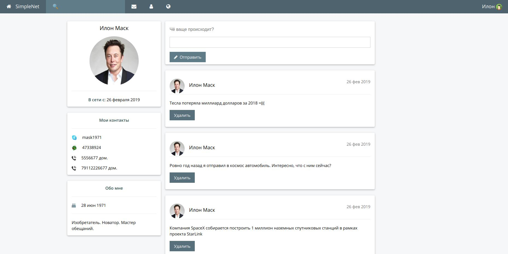
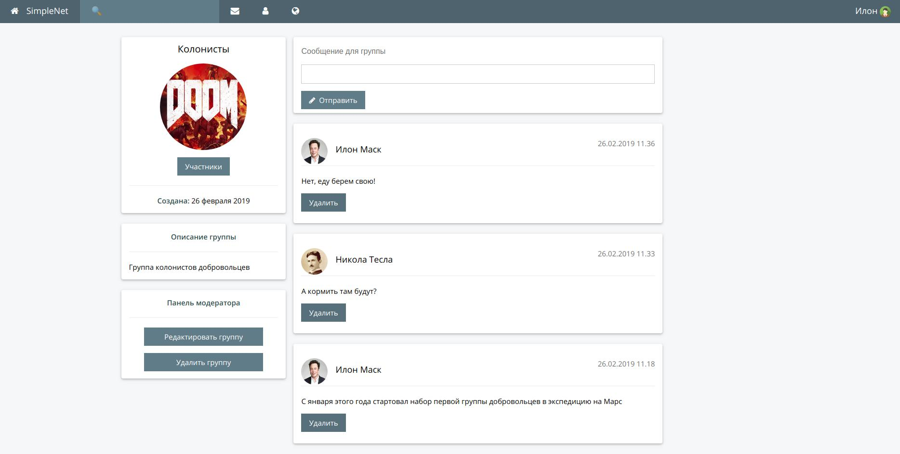
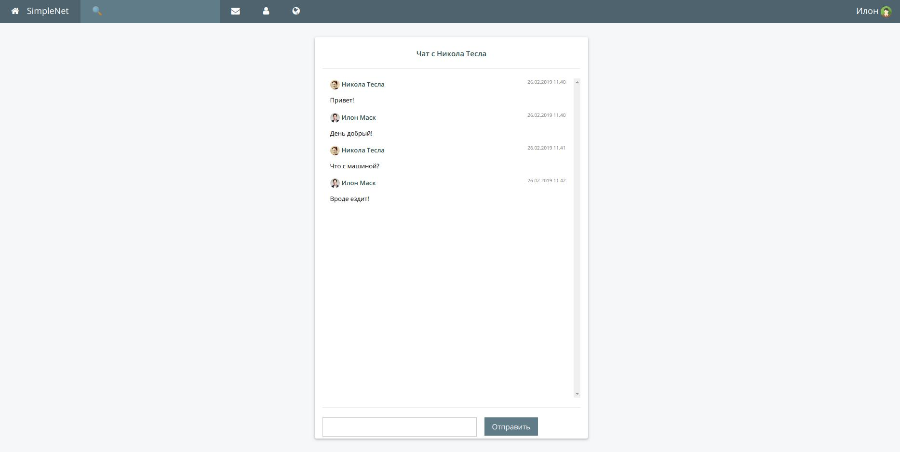

# Project "SimpleNet"

**Functionality:**  
  
+ registration  
+ authentication with Spring Security  
+ display profile 
+ edit profile 
+ users export to / import from XML 
+ posting wall messasges
+ groups creation  
+ posting group messages
+ adding friends   
+ messaging through WebSocket  
+ AJAX search with pagination

**Tools:**  
JDK 8, Spring 5 (Boot, Security, Data, WebMVC), JPA 2 / Hibernate 5, XStream, jQuery, W3CSS, JUnit 4, Mockito, Maven 3.5, Git / Bitbucket, Tomcat 8.5, MySQL, IntelliJ IDEA.

**Screenshots:**  

  

  

_The project hosted at_ http://simplenet.elimental.ru  
  
Test account: test@mail.ru  
Password: qwerty  
__    
Training getJavaJob    
http://www.getjavajob.com     